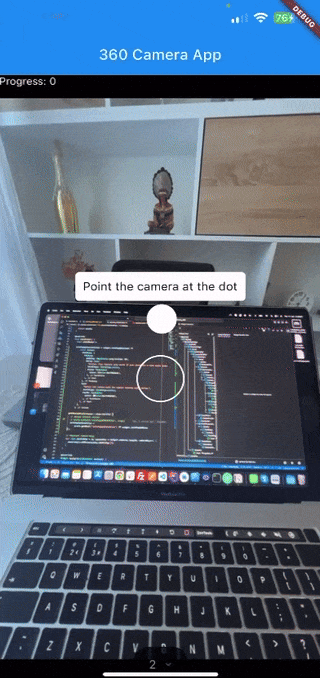

# 360 Camera

This plugin allows the users to take 360 Panoramic Images using the phones Camera. It uses OpenCV to stitch the images together.
A simple UI guides the user throughout the process, by displaying dots on the screen that the user should follow.

### Demo
Checkout [Tridiar - Virtual Tours](https://tridiar.com) application on [iOS](https://apps.apple.com/us/app/tridiar/id1593706196) and [Android](https://play.google.com/store/apps/details?id=com.tridiar.agent)



# Installation

### IOS
Add these lines into `Info.plist`
```plist
<key>NSCameraUsageDescription</key>
<string>This application needs access to your Camera in order to capture360 Images</string>
<key>NSMicrophoneUsageDescription</key>
<string>This application needs access to your Microphone in order tocapture videos</string>
<key>NSPhotoLibraryUsageDescription</key>
<string>This application needs access to your Photo Library in order to saved the captured images</string>
```

### Android

#### Attention when building release versions since OpenCV has been built for different CPUS we recommend running this command to build multiple APKs:

```properties
flutter build apk --split-per-abi --release
```

Change the minimum Android sdk version to 21 (or higher) in your `android/app/build.gradle` file.

```properties
minSdkVersion 21
```

`AndroidManifest.xml`

```xml
<uses-permission android:name="android.permission.WRITE_EXTERNAL_STORAGE" />
 ```

### Dart
```dart
import 'package:camera_360/camera_360.dart';
import 'package:image_picker/image_picker.dart';
Camera360(
  // Preparing panorama text
  userLoadingText: "Preparing panorama...",
  userHelperText: "Point the camera at the dot",
  // Suggested key for iPhone >= 11 is 2 to select the wide-angle camera
  // On android devices 0 is suggested as at the moment Camera switching is not possible on android
  userSelectedCameraKey: 2,
  // Camera selector Visibilitiy
  cameraSelectorShow: true,
  // Camera selector Info Visibilitiy
  cameraSelectorInfoPopUpShow: true,
  // Camera selector Info Widget
  cameraSelectorInfoPopUpContent: Widget,
  onCaptureEnded: (data) {
    // Returned data will be a map like below
    //{
    //  'success': true or false
    //  'panorama': XFile or null,
    //  'options': {
    //    'selected_camera': int KEY,
    //    'vertical_camera_angle': int DEG,
    //  }
    //}
    if (data['success'] == true) {
      XFile panorama = data['panorama'];
      print("Final image returned $panorama.toString()");
    } else {
      print("Final image failed");
    }
  },
  onCameraChanged: (cameraKey) {
    print("Camera changed ${cameraKey.toString()}");
  },
  onProgressChanged: (newProgressPercentage) {
    debugPrint("'Panorama360': Progress changed: $newProgressPercentage");
  }),
),
```

> `onCaptureEnded` will return `XFile` or `null`  
> - `XFile` if the panorama has been captured successfully   
> - `null` if the panorama has failed  


## [Developer Documentation](docs/developer.md)


    